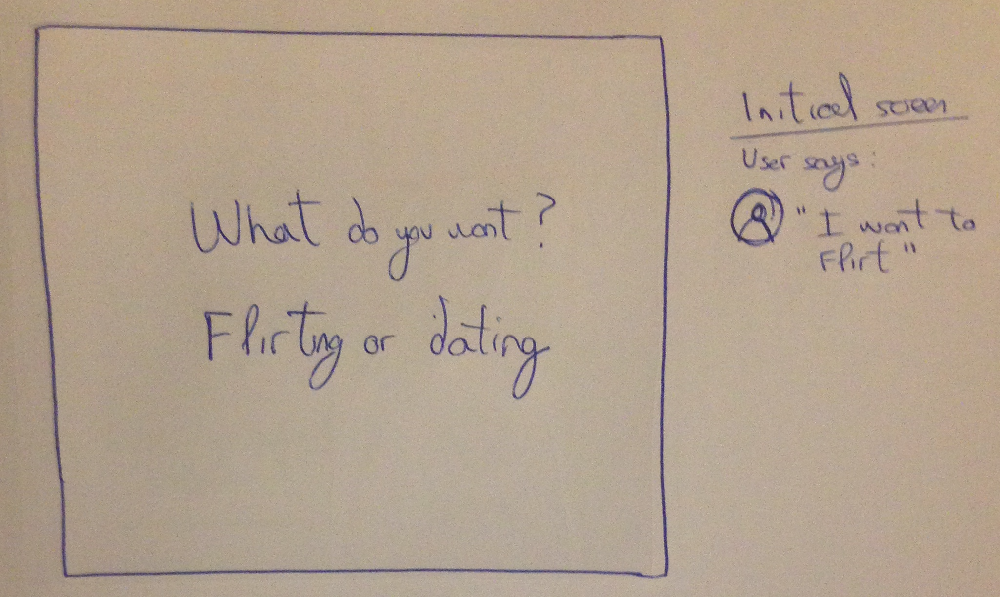
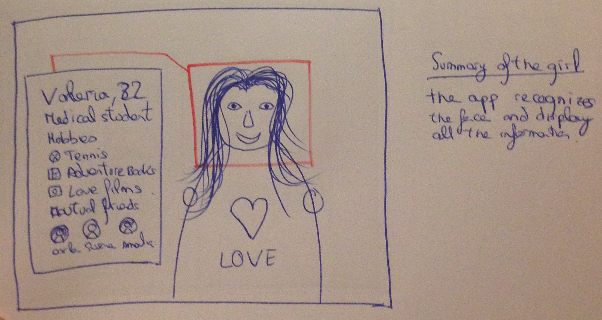
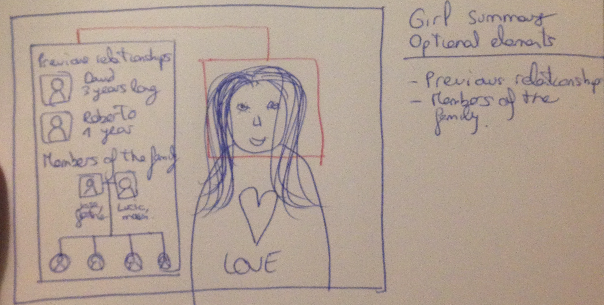
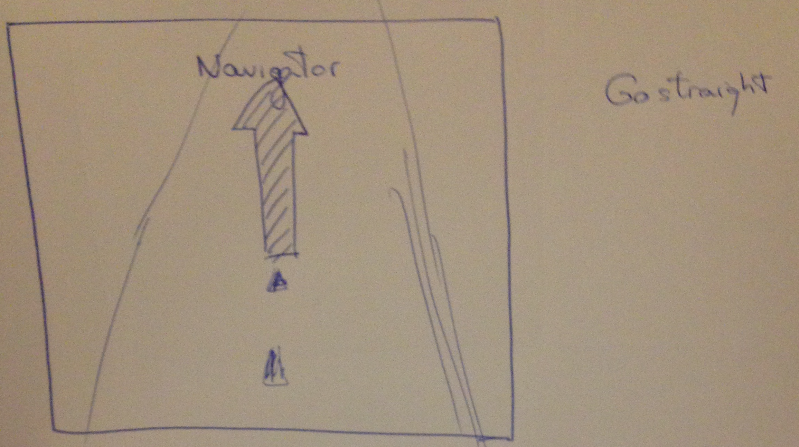
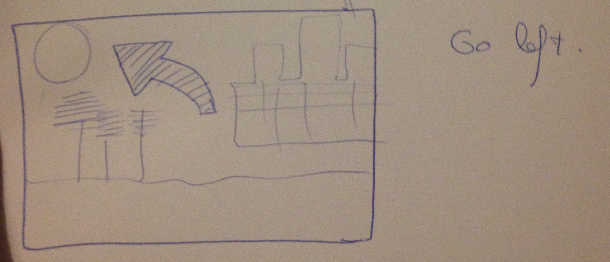
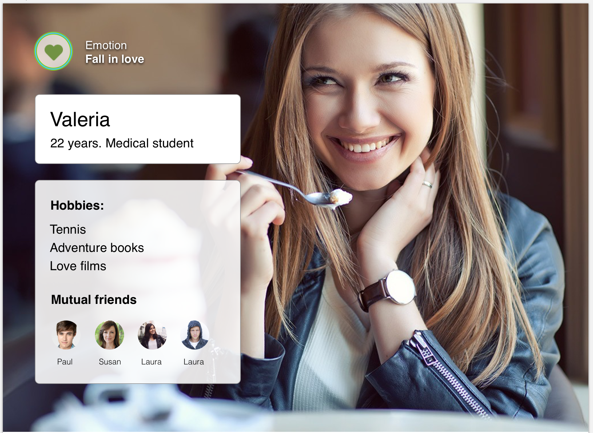

# Iteration 3

A new team is in charge of the third iteration. Our approach will be different: start working on each of the 6 steps, adding new visions and ideas without being conditioned by the previous iteration. After the end of each step we compare this new ideas with the version from the previous iteration. And then we decide what new elements leave. At the end of this iteration  we will make new sketches, rewrite some parts of the documentation and prepare the work for the next iteration.

Thanks to this approach we can work creatively and without any constraints from prior work, so the value of the new ideas is higher. This is truly important in order to think on new concepts completely free.

## 1. Form factor, postura and input method

### Getting the information from context scenarios

First we will focus on Josh, the primary persona defined in the milestone 2. As we defined, Josh has 4 problems. The reader could go to the previous milestone and see the problems, but we will also include them here and make some improvements.

For making the **form factor** we will use most of the Josh problems. We have rewrite many problems from Josh to improve the design.

- Problem 1: Josh is uncomfortable and doesn’t know what to say.
- Problem 2: The girl is bored of the place where they are and wants to go to do something else. She asks Josh for advice but he is in blank.
- Problem 3: Josh doesn’t know the girl and he doesn’t know where to set the first date in order to success.
- Problem 4: The girl starts a conversation with a subject that Josh doesn’t control (for example a tv star that Josh doesn’t know). Josh is getting out of control of the situation.

Also we think some visions proposed on the previous iteration could be improved. So these are the problems and the new visions for some of them:

- (new vision) Problem 1: a list of topics ordered by percentage of affinity with the girl will be shown on the screen. When Josh starts talking one of the topic from the list, the application will hide the topics. When Josh does not know what to say on some topic, the application will say Josh what to say on this topic. After some minutes, it will generate new topics. 

- (new vision) Problem 3: The application will search all the available information of the girl and will create a summary with the most relevant data. Josh will see (if he asks our application) a summary of the girl interests, hobbies, family members, common friends, basic information, etc. Then the  application will suggest 3 places to do the date (ranked based on the girl information). And finally, Josh can book the restaurant directly from the application.

- (new vision) Problem 4: instead of the raw wikipedia information, the application will show a summary of the most relevant information from different sources (books, newspapers, blogs, wikipedia, etc). Moreover, the application will display 2 sentences to follow up the conversation in this topic.

###Form factor

Our hardware (the lenses) is combined with software (augmented reality application) to offer a great user experience. The lenses are very comfortable and they are smoothly integrated in the eyes, so this is an advantage.

Our product is integrated in the user eyes, so we have the possibility to create a 180 degrees interface. However, we only want to concentrate our design in very defined and **strategic areas** that will let the user to **interact naturally** while receiving a valuable information to have a successful date.

Thanks to augmented reality we have plenty of possibilities to display all elements in the screen. But as we say in the prior paragraph, we are creating a layer on top of the real world that should be performed naturally. So at any time when a new data or notification is available the application will recognize the environment and decide how to adjust correctly the notification (color, size, etc). 

**Night** is the time of the day where the vast majority of our users will use the application. For example, Josh, our primary persona normally hangs out on bars during night.

However, we must take into account that people also dates during the **afternoon** before going to dinner. With this two concepts in mind, we think the best idea is to prioritize the design decisions only for the night environment while validating the design on daylight too.

It's only necessary to wear the lenses while dating. So, we need another way to interact with our product and review their previous dates on a daily basis. So in this iteration we have thought that a mobile app is really important to complement the lenses.

This mobile app will be used normally during the day (for example, when they are at the university, taking food, etc). And the user will see a history of previous dates (where did they go, what topics did they speak and how was the date). Also this app will have the contact information of the girl and a list of contact methods (emails, mobile phones, etc).

###Posture

From previous iteration we realised our application has enough potential to take more part on the dating process instead of being just a daemonic who only acts in the background.

The application will have mainly a **transient posture** while dating. This is more helpful for Josh and non-intrusive (it will still have simple elements on the screen, very well placed and the information will not appear all the time). We changed our vision from iteration one because we realized Josh has serious problems while dating because he is really insecure and he needs more help to feel he has the control.

However, this transient posture will not be applicable all the time. The application will adopt a **daemonic posture** on intimate moments, when the user is feeling self-confident and secure. So this will let the passion and magic flow.

### Input methods

In this iteration we are defining in depth the input methods in order to give a proper vision of the product. 

The **voice** is the primary input method. The lenses are listening for keywords/sentences all the time and based on the audio it takes the correct action. This approach is the most unobtrusive and elegant.

The application only recognizes the voice from the owner of the lenses. So if any other people around say some keywords, the app will ignore it.

As we said, the voice is one of the main sources that the augmented reality app uses to work properly. But, the mobile app we introduced in this iteration uses **touch screen** to work. 

Talking about inputs, we have to note that the application also receives information from the outside world: gestures, facial expressions, voice of the girl, weather in the zone, reactions, etc. Although these are not input methods from the user who is using the application, this is extremely related and it is really useful to know what information the application sensors will receive.

##2. Define functional and data elements

### Preparing the requirements

In this second phase of the iterative process we are taking into account mainly the requirements from the primary persona but also having some other requirements from the secondary personas (the ones we think are more important or critical). 

During the first step on this second iteration we have added new visions to solve Josh problems. So it's advisable to revisit and adapt requirements to the new vision taking by the designers in this second iteration.

In the following list you can see a list of the requirements we will take into account in the following steps. All of them are based on the requirements from the user but they have been adapted and also rewritten from the first iteration. We have prioritize the requirements from the primary persona but also we have included extra requirements from the secondary personas.

- The summary of the girl is displayed in the screen. This information is extracted from social networks and family connections.
	* The user can configure if he/she wants to see previous relationships history inside the girl summary.

- The list of conversation topics are displayed in the screen taking into account the girl hobbies and knowledge.
- A bunch of **sentences** to speak about a topic are generated and suggested to the user in the screen. This information is extracted from different sources: books, blogs, videos, wikipedia...
- The voice recognition system hears the user commands and take the correct actions.
- A sensor to identify the emotional state of the girl is required. The emotional state is calculated given different variables (gestures, expressions and voice), it's shown in the screen.
- A non-intrusive approach should be taken when designing the application so the users can focus on the conversation while reading the extra information.
- The app analyzes constantly the gestures, expressions and feelings from the other person and says how is she feeling.
- A list of suggested places to have the date or to move in, ranked by girl preferences is shown. Also the application can book directly. 

### Catalog of data elements

Taking into account the information written in the prior block *Preparing the requirements* we are defining the data elements of the application.

#### Summary of the girl

We need to display the following information:

- Personal data: name, age, studies or work.
- Hobbies.
- Common friends.

Optionally, the user can configure the application to:

- See a history of the previous relationships.
- Members of the family.
- Kind of relationship she is looking for: long-term or short-term.

#### Conversation topics

- Suggest 3 topics to talk given the girl interests, background and hobbies.
- Automatically display new topics when the girl is getting bored.

This is related with the data element *Sentences to talk about a topic*. So first the topics are suggested and then the application propose smart and excellent sentences to say about the topic.

#### Sentences to say about a topic

When the user doesn't anything about a topic or maybe he doesn't know what to say, the application will help him to say smart and excellent sentences. 

In order to accomplish this, we need:

- Propose a list of 3 sentences to say about the topic.
- Obtain the information from many sources and create a valuable sentence to impress the girl.

Optionally, the user can configure the application to propose the sentences plus a brief summary of the topic. This summary is only shown the first time the new topic is used.

This data element is related with the prior one. Because the application proposes topics that are relevant for the users and then creates smart sentences around it.

#### Emotional state

- Calculate the emotional state of the girl using the gestures, expressions and face sensors.
- The application will show the percentage. So the user can learn what are the topics the girl loves and also can use the information to take decisions.

#### Suggested places

Our primary persona does not know where to organize dates. Neither when is the correct time to move to another place because the girl is bored or because it's the time to take the date to a higher level.

So before the date, the user will receive in the mobile application a list of suggested places given the girl preferences. Then Josh, can book it directly through the application.

On the date, the augmented reality app will notify the user if it's the time to move to another place.

- The mobile app will propose 3 places to organize the date.
- The augmented reality app will analyze the girl preferences and propose 3 places to move when it's the right moment.
- All of the place are ranked by the girl preferences.

This is related with the *Booking the place* data element, because the app will let the user to book the place.

#### Booking the place

After the application proposed the places, the user can book directly a table or a place. 

- When the voice microphone heard 'Let's go to Hard rock cafe restaurant', the app will automatically book a table.
- Also the application will start a navigation map.

This data element is related with the *Suggested places* because you select and book a place. And also with the map element, because it will guide you to the destination.

#### Map

- A map to go to the place is generated and the application help the user to reach his destination.
- Distance is calculated given your current location.

This is related with the two prior data elements.

#### Configuration of the application

The following list is the options the user can configure to personalize the experience using the application.

- Decide to show a brief summary of the topic.
- See a history of the previous relationships.
- Show members of the family.
- Kind of relationship she is looking for: long-term or short-term.
- For how long the girl summary should be seen on the screen.

### Functional elements

After defining the new requirements and also the data elements, we need to translate all this information into defined user actions in the application.

- Get <action> a conversation topic <object> when the user wants to know what to say
  The application is constantly analyzing the girl (movements, gestures, feelings).
	1. The conversation is starting to be not so interesting or the girl is not comfortable.
	2. The application generates 3 new topics, taking into account the girl preferences, the man knowledge and also the state of the date (eg: starting, end of the dinner, etc).
	3. When the man starts talking about the topic, the application automatically recognize it and hides the rest of the topics.

- Read <action> a summary of the girl <object> when the user wants more information <context>
	1. The augmented application analyzes the face of the girl and search all the available information online
	2. A brief summary of the girl is shown on the screen. The application finds the best place to put the summary depending on the situation.
	3. The summary disappears after some seconds (this is configured by the user)

- Get <action> sentences to say about a topic <object> when the user is insecure or doesn't know what to say <context>

	1. The application sensors recognize that the user is insecure or does not know what to say.
	2. The application generates a list of topics, ranked by popularity (the most relevant for the girls).
	3. The user says the sentence.
	4. The application microphone recognizes that the user has used one sentence and hide the rest of the sentences.

- See <action> emotional state of the girl <object> every time of the conversation <context>

	1. The application camera analyzes the face of the girl and also the gestures and expressions.
	2. The emotional state is recalculated at real time and it is display on top of the view.

- Get <action> a list of suggested places <object> to make the date or to go there <context>

	1. The girl wants to move or the man wants to book one restaurant.
	2. The application will automatically generate a list of suggested places (ordered by girl preferences).
	3. The man says "Let's go to NAME" and the list disappears

- Book <action> a restaurant or a place <object> for a date <context>
	
	1. After the man says "Let's go to NAME", the application hides the suggested groups.
	2. The application makes an order or a reservation in the chosen place.
	3. The application notify the user that the reservation has completed.

- See <action> the map <object> when the user wants to go to the place <context>
	
	1. When the user says "Let's go to <name of the restaurant>" the application automatically calculates the best route and start the navigation mode.
	2. The indications are displayed on the screen with arrows.
	3. When they arrive to the place, the navigation mode disappears.

- Configure <action> the application <object> at home <context>
	
	This action can be done in both applications (mobile or augmented reality). The only difference is the way to accessing the feature.

	In the augmented reality:

	1. The user says "Go to configuration" and the configuration options are shown.
	2. All the options are displayed in the screen
	3. The user uses the hand to pick one attribute and change the value.
	4. The user says "Go home" and it exits.

	In the mobile app:

	1. The user clicks on configure
	2. Then, he selects the field to change.
	3. The field value is changed.
	4. The user exists.

##3. Functional groups and hierarchy

In this iteration we are going to change the structure and content from the previous iteration. We are focusing more on the **two goals for the user**: getting information about the girl (flirting) and be successful while dating.

So there are two functional groups. Because one is the group when you want to get information about the girl or maybe you want to remember a date you have with the girl. The second one is when you are having the date with your love.

- Flirting.
- Dating.

The application will work differently in both cases because the goals of the user change in each case. In the first he is trying to get information or remembering a previous date. And in the second is when you are already with the girl, so the app will help you to get the love.

#### Flirting

This includes all the situations when you are flirting with the girl, like chatting, seeing at first time or after the first date. Because our application can record too all the previous dates you have with the girl or helping you to get the date.

**Views:**

- Summary of the girl.
- Pick a place to date and book it.
- Configuration of the application.

#### Dating
 
Now the user goal is **getting the girl**. So in this case the application will help you to have an awesome date and to get the true love. 

We have included all the features related with having a conversation, knowing the girl emotions and also to move to another place. 

**Views:**

Chronological order:

- Conversation topics.
- Sentences to say about a topic.
- Emotional state.
- Go to another place and book it.
- Map navigator.

##4. Sketches iteration 2

#### Design notes

Conceptually, we will divide in **three containers**: dating, flirting and configuration. By default, the application will be on flirting mode, but the user can change at any time.

The application is designed like **a layer on top of the real world**. So the user uses the voice to navigate through the different parts of the interface..

We have decided to let the application choosing where to place the **notifications depending on the position of the girl**. Now it will use different techniques to measure the distances between left, right, top and bottom margins. For example, if the girl is situated on the left part of the screen, the application will place the notification on the right part and vice versa.

However, in our sketches we will place the girl on the middle/right part of the screen so the notifications will be on the left side.

Visually, the application will be really minimalist and will have minimal elements. The 'views' are different layers that the application puts using augmented reality.

#### New sketches

The user will only use the voice to navigate through the application. This is challenging but very interesting from the designing point of view.

##### Main window

So the user starts the application with the main view.
Here he can selects which mode he wants to use.

For example, the user says: "I want go flirting"

##### Girl summery

The application uses the camera to analyze faces. If it's the first time the user see a girl, then a summary is shown. 

The summary contains all the important information. Also there is some extra information that the user can show. This extra fields are configured in the configuration view (continuous reading).

##### Places to make a date

The user says: "Show me a list of places to eat" or if the user is having a date, then he can say some secret keywords like this: "Hey girl, I want to have a dinner with you", so the application recognizes the user purposes and then shows a list of places.

The places are selected taking into account the girl hobbies, experiences, background and so on.

##### Make a reservation

Then the user can say: "Let's go to Hard rock cafe". Then the application automatically make a reservation and also initializes the map (to see the map views you have to scroll down in this document).

##### Account configuration

The user says "Go to configuration" and then he can configure some extra stuff that appears on the screen.

To active something the user says: "Activate show members of the family"

##### Conversation topics

While dating, the application will show a list of topics to talk. This list only appears if the application detects the user is nervous, does not know what to say or the girl is bored.

When the user start talking on one of the topics, the application automatically hide all the topics from the screen

##### Sentences to say

On any topic, the application proposes smart sentences to say about the topic.
This feature can be deactivated from the configuration view.

##### Emotional state

While dating the application shows the emotional state of the girl. Some of them can be: 'bored', 'happy', 'loved', 'calmy', 'aggressive'.

##### Navigation map

After the user has selected a restaurant the application automatically starts the map navigation.

Also the user can activate this feature saying: "Hey. let's go to Goiko restaurant". The app searches the location of the restaurant and starts the navigation.

The following sketches are the different indications the user will receive: go left, right, etc...

When the user arrives, the application automatically hides the navigation mode.

### Comparing sketches with the first iteration

We think that from the first iteration there was some cool ideas. For example, the notifications bar or the love icons. However, some parts of the concept didn't go well. In our opinion, giving the raw information is bad, because he can't spend time reading many stuff while dating. 

In this iteration, we solved this problem being more precise and direct to the information the user should say. So we add the 'sentences suggestion' that let the user reply with smart sentences on any topics. 

Also, we try to simplify the UI elements. And now the notifications are displayed depending on the available space.

Also, we have added more views for making a reservation and changed the maps. We basically use arrows to notify the user what to do.

And we have removed the hearts and put a fixed warning about the state of the girl on the date.

In general the first iteration was a good work but we have improved and simplified many stuff.

##5. New keypaths and some validation

In general the new sketches fits better with the keypath scenario. In this iteration we have redefined some of the previous keypath scenarios because the way of interacting with the application has changed slightly.

Now we will write some new keypath scenarios for the new sketches and also writing new validation scenarios.

#### Keypath 1: flirting

The user is alone at home and put the lenses. Then he goes to the university and see a beautiful girl. Then, the application automatically recognize her face and display all the girl information in the screen.

Then, the application generates a list of places to make a date. All of this places are the favourite ones of the girl.

Then our application shows a message in the screen saying: "Go to the lady and say: 'Hey, I think you are the kind of girls who loves Hard rock Cafe. Aren't you?".

The lady is shocked, because she has never met a guy who know she loves this place. So the application updates the emotion message to: 'Impressed and open to meet'.

Then our app displays all the hobbies of the girl and she loves 'Harry potter films' so the application display another message: 'Say: Hey, I know this could sound weird but your face looks like Hermione Granger'

The girl was surprised and say: 'What? Hermione is my favourite character of harry potter. I'm a big fan!'.

Then the application displays a message on the screen and says: 'Say: wow! Really? I'm a big fan too! haha. I heard that there will be an special event about harry potter on Hard rock cafe next tuesday. Do you want to come with me?'.

And the date was done thanks to our application!

#### Keypath 2: dating

So the tuesday, both were meeting on Hard Rock Cafe. Our man, put the application on dating mode, saying: 'Go on dating'.

The girl was incredible and Josh was really nervous and he went blank. However, the application suggested 3 topics to speak: Tennis, love films and trips. She love all those topics and Josh started to speak about tennis. 

Then all the topics disappeared and the application suggested some sentences. We have to say that Josh doesn't know anything about tennis... However, the app put: "Hey Vanesa, I'm a big fan of Pete Sampras. Do you like him".

Vanesa was super happy! Because Pete Sampras is her favourite tennis player. Then the application says more sentences like: 'I love the match Boris Becker in 1996. It was amazing and Pete won!'. Surprisingly this is the favourite match for Vanesa. Both were talking hours about tennis, love stories, adventures... So our app was working really well.

Then the application suggests Josh 3 more intimate places to move. Because it's the time to go to the next level. So then Josh says: 'Hey vanesa. Would you like to go to circulo de Bellas artes rooftop'.

Curiously, this is the favourite place of Vanesa in Madrid (well is not so curious, the application is doing the magic). So she say yes.

Then Josh says: 'Okey! Let's go to Circulo de Bellas artes'. So the application automatically booked a private place there and started the navigation mode.

At the end of the date, in the circulo de bellas artes, the emotion of Vanesa was: 'Starting to feel in love'. So the application suggests: 'Josh. It's the moment to give a kiss. Go!'.

And this is the end of this happy story. Josh and Vanesa are now happily engaged and this story has a happy ending.

## Iteration 3: final thoughts

The team has enjoyed a lot working on this iteration because the process was very creative and really challenging. We have improved many stuff from previous iteration, redefined some concepts and added new incredible functionalities.

The first iteration has some good ideas. However there were many things to improve and this iteration was hard and a long process. But we are happy with the result.

The working process starting from a non-opinionated and very creative state of mind was crucial to improve the previous designs. Also, we found really interesting to compare the new ideas with the first iteration so to choose the best of them. In general terms, we have redesigned from scratch many stuff, but both iteration has great things on it.

In general terms, our product is starting to be very defined and we can't wait to start the new iteration to think if we want to add some new functionalities (if needed) and to make a higher fidelity designs.

In the future of our application we would like to also create the mobile app to let the user get more information without needing the lenses

# Iteration 4

So from the previous iteration we have done many work and we are ready to start working on higher fidelity designs!

We think there are some extra functionalities that could be added to the product, for example a catch liars detector. But we have decided not to work on new functionalities, because the core of the application is done and this new features do not add any new interesting things to our targeted personas.

So now we are focusing on creating the higher fidelity designs. We have started to work from the mockups and this is the final result:

The application will recognize the face of the girl and displays the information of the girl.

And now the user sees a list of topics to speak with the girl

We have checked that the design is valid taking into account the previous work for the milestone 2 and the keypaths.

